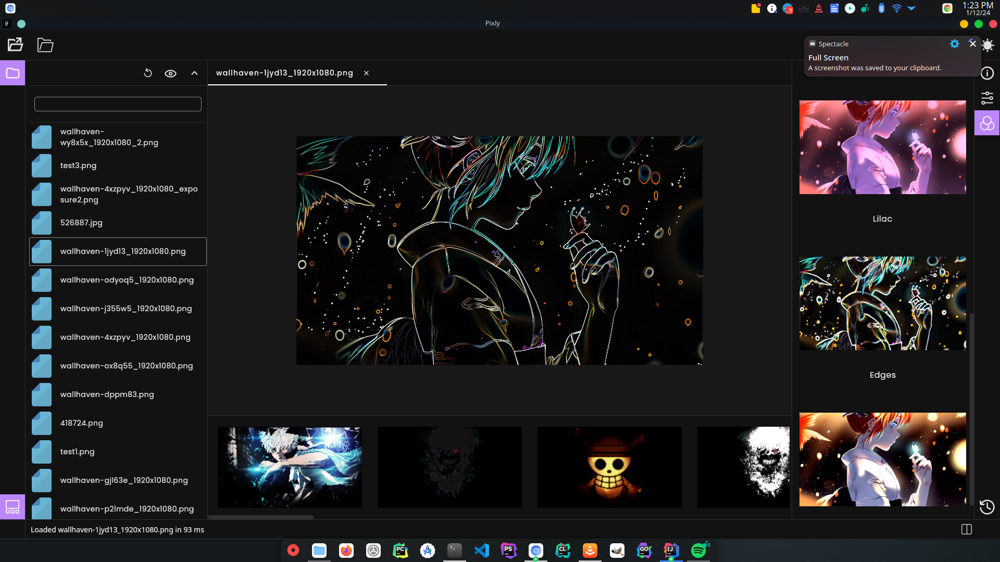
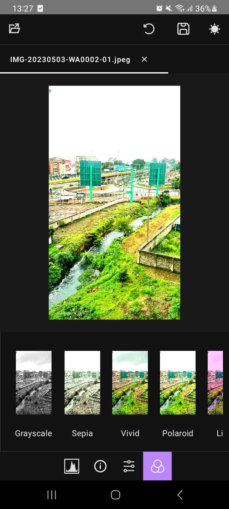

# Pixly - An image editor


Pixly is an image editor built in Compose Multiplatform and Rust that works on Windows, Linux and Android devices

- Compose makes the GUI 
- Rust via [zune-image] deals with image manipulation operations.

## Architecture
I've written on how the two apps work in my blog

## Motivation
I wanted a simple lightroom alternative that works on Linux.

## Demo
Watch the video of demo (Youtube)

### Desktop (Linux)

https://github.com/etemesi254/Pixly/assets/24320659/780868d5-78b4-4ba9-91ee-6fc16980f58b

### Android

https://github.com/etemesi254/Pixly/assets/24320659/386746bd-a2ee-4b0b-b63f-a6a60a074c0b

## Pics

### Desktop

#

### Android

#

## Features.

- Load images in various formats - png, jpeg, ppm, jxl, bmp, qoi, pfm.
- Save images in various formats- jpeg, png, webp, bmp, ico, gif.
- Choose quality of saved output.
- Tabbed-layout : Open multiple images at once.
- Multiple image editing options, rotate, transpose, change brightness, blur add sepia to image, level adjustment etc
- Undo history.
- Responsive layout - Choose what widgets you want to use, rearrange them at will
- Infinite zoom in and zoom out.
- Double paned editing that shows you original vs edited picture side by side
- Thumbnail generation.
- Directory navigator (Desktop)
- Light and dark theme options
- Retrieves image information including exif data and shows image histogram
- Pre-configured filters such as `sepia` and `vivid`

##  Running


### Android
If you just want to install the apk in your device, there is a release containing an `.apk` in the
[release page](https://github.com/etemesi254/Pixly/releases/tag/0.1.0) which you can install to test

If you want to run on Android, you need to set up your environment,
see [instructions on how to do that](https://github.com/JetBrains/compose-multiplatform-template#setting-up-your-development-environment).

After setting up, load this project into your IDE and choose to run on a mobile device or an emulator

### Desktop

!!!{TODO}


## Building

For compiling the Rust dynamic library, see instructions on [README](./rust/README.md) on how to do that.

### Android

You need to have an IDE capable of android Development, recommended and tested IDEs are Android-Studio and Intellij-Idea Ultimate.

You also need to have Android-SDK configured and Android-NDK configured if you are going to build the Rust binaries(see README on Rust on what to change)

### Steps.
1. Clone this repo 
    ```shell
    git clone https://github.com/etemesi254/Pixly
    ```
   
2. Load it in the IDE
3. Choose the device 
4. Run `composeApp` on Android
5. Wait
6. Profit

### Linux.
The main hurdle is getting the jvm/system loader to load the native library that contains the [zune-image] library bindings


### Windows

Ensure you run this on the same directory in order for the system to find the libraries (Windows searches for DLLS in the location a binary was loaded from)


[zune-image]: https://github.com/etemesi254/zune-image
